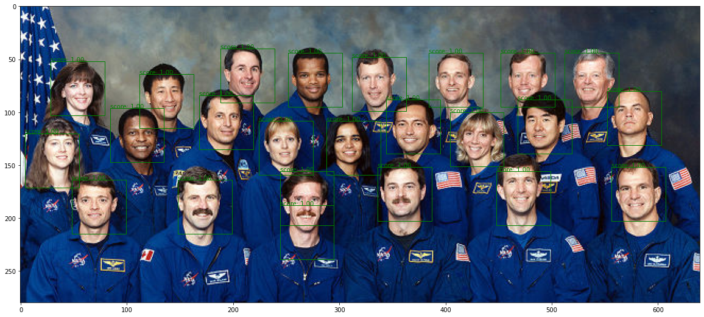

# PyACF

This is a naive python implementation of Aggregated Channel Feature classifier. For simplicity, it does not follow all the advanced detals in the literature and the speed of detection is extremely slow. Therefore, it is only for education purpose and not suitable for any comercial use. The missing features including: 

1. Fast pyramid feature algorithm is not implemented, the detection is extremely slow
2. Multiple-class detection have not been implemented, one-class detection only
3. The soft cascaded classifier is simplified into a single classifier
4. The max/min size of detecting sliding window is 80 x 80/16 x 16 or manually set

The source code of this version is very simple and straigt-forward. Need more contributers to finish the above goals.

## Files

The repository have data folder. The data folder should contain two subfolders named "positives" and "negatives", and one annotation file named "label.csv". The positive subfolder includes images with the face in picture, and negative subfolder includes only the images that has no human face, mostly nature landscape. The label csv file have coordinates of bounding boxes in positive images. 

The model folder stores the training results. After training, the model parameters are stored in the path address. 'model/weights.pkl'is default address.

The demo.ipynb file contains a quick tutorial of how to use this package.

## Quick Start

Install the package

```bash
pip install pyacf
```

Import the packages for 

```python
import cv2
import pyacf as acf
```

Prepare all training data in one folder, here we use 'data' for our example and run the following command to get the input data. You can replace 'data' folder into any your folder name.

```python
positive_array, negative_array = acf.preprocess(folder='data')
```

Check the shape of positive and negetive data. In our example dataset, we labelled 76 positive patches, and we also prepared 350 negative patches. Therefore, the shape of positive_array should be 76 x 80 x 80 x 3 and the negative_array should be 350 x 80 x 80 x 3

```python
print(positive_array.shape, negative_array.shape)
```

We use the train() funciton to train a casacaded adaboost classifier. After training, the model parameters are stored in the path address. 'model/weights.pkl'is default address. The training process takes 5 minites

```python
acf.train(positive_array, negative_array, path='model/weights.pkl')
```

he detect() function will load the AdaBoost classifier and use a sliding window to find candidate face patches, and eventually use NMS to pick the most possible bounding box. Since this implementation is a naive solution, the detecting speed is EXTREMELY slow and you have to wait 30 minutues to finish. After about 8 asterisks displayed, the detection will be finished.

In this test picture, for simplicity we manually use 51 x 51 as the only size for sliding window. To reduce false positive, we also increase the threshold from standard 0.5 to 0.98

We need import opecv to read data from jpeg file

```python
img = cv2.imread('data/face_test.jpeg')
bboxes = acf.detect(img, min_threshold=0.98, window_size=[51])
```

Finally use the display() to plot the results via matplotlib. The scores are also annotated with the bounding box.

```python
acf.display(bboxes, img)
```

